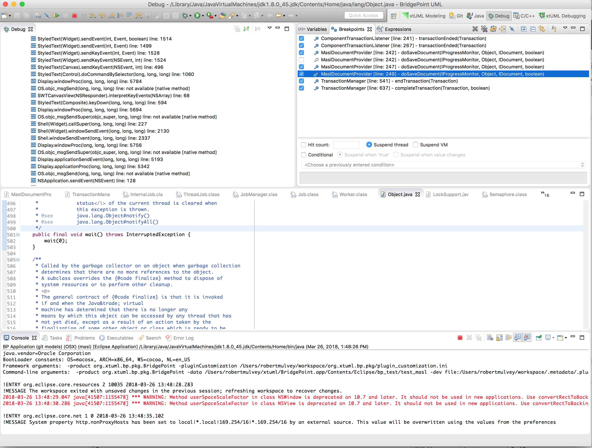
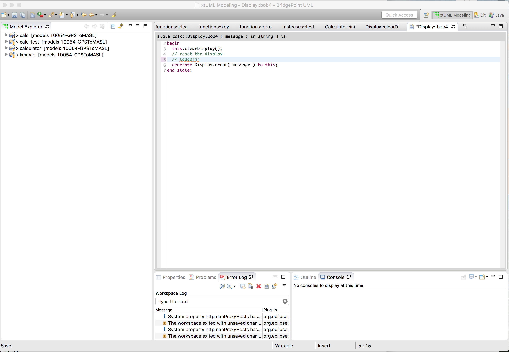

---

This work is licensed under the Creative Commons CC0 License

---

# Tool Locked Up While Exporting Domain
### xtUML Project Implementation Note

### 1. Abstract

User reported that the BridgePoint tool locked up while exporting a domain (MASL dialect in use). 
The user had to exit the tool and kill the running process. After the "lock up", user reported that
selecting cancel or the 'x' on the main eclipse gui had no effect.  

### 2. Document References

<a id="2.1"></a>2.1 [BridgePoint DEI #10161](https://support.onefact.net/issues/10161) This issue.  
<a id="2.2"></a>2.2 [BridgePoint DEI #10138](https://support.onefact.net/issues/10138) Related Service Pro issue.  

### 3. Background

The user is unable to provide a reproducible case. However, the user is able to provide a thread dump, and it is attached to the issue [[2.1]](#2.1).  

### 4. Requirements

4.1 Isolate the situation that causes the deadlock/hang.  
4.2 Make change(s) as needed to prevent the deadlock/hang from happening.  

### 5. Design

5.1 Analyze the thread dump(s) reported by the user.  
5.2 Examine the flow of control of the code in the area(s) that the stack dumps show a deadlock.  
5.3 From the analysis, determine likely scenario(s) for which the deadlock may occur  
5.4 Reproduce the problem (if possible)  
5.5 Explain the deadlock, propose solution, implement.  

### 6. Implementation 

6.1 Analysis of the thread dump(s)   

The thread dumps the user provided indicate that the deadlock is between the xtuml 
xtext editor and the BridgePoint transaction processing. Below are snippets from the dump 
and the related code.  

This is the "main thread" (the display thread in Eclipse). From this, we can see that 
a MASL editor save operation is in progress.  
<pre>
main                 	 RUNNABLE 	 6 	 Normal
java.lang.Thread(Thread.java:-2)
java.lang.Thread(Thread.java:1603)
org.xtuml.bp.core.common.TransactionManager(TransactionManager.java:641)
org.xtuml.bp.core.common.TransactionManager(TransactionManager.java:564)
org.xtuml.bp.core.common.TransactionManager(TransactionManager.java:542)
org.xtuml.bp.ui.text.ModelElementPropertyStorage(ModelElementPropertyStorage.java:135)
org.xtuml.bp.ui.text.AbstractModelElementPropertyEditorInput(AbstractModelElementPropertyEditorInput.java:121)
org.xtuml.bp.xtext.masl.ui.document.MaslDocumentProvider(MaslDocumentProvider.java:242)
org.xtuml.bp.xtext.masl.ui.document.MaslDocumentProvider$$Lambda$82/1428658825(null:-1)
org.eclipse.swt.widgets.RunnableLock(RunnableLock.java:35)
...
</pre>

The above stack dump references MaslDocumentProvider.java:242 which is in the 
operation MaslDocumentProvider.java::doSaveDocument(). The arrow below shows line 242.
<pre>
        Display _default = Display.getDefault();
        final Runnable _function = () -> {
          try {
-->         ((AbstractModelElementPropertyEditorInput)element).setPropertyValue(newDefinition);
          } catch (Throwable _e) {
            throw Exceptions.sneakyThrow(_e);
          }
        };
        _default.asyncExec(_function);
</pre>

This is BridgePoint transaction processing.  
<pre>
Worker-389           	 WAITING 	 5 	 Normal
java.lang.Object(Object.java:-2)
java.lang.Object(Object.java:502)
org.eclipse.core.internal.jobs.ThreadJob(ThreadJob.java:270)
org.eclipse.core.internal.jobs.ThreadJob(ThreadJob.java:197)
org.eclipse.core.internal.jobs.ImplicitJobs(ImplicitJobs.java:92)
org.eclipse.core.internal.jobs.JobManager(JobManager.java:307)
org.eclipse.core.internal.resources.WorkManager(WorkManager.java:120)
org.eclipse.core.internal.resources.Workspace(Workspace.java:2189)
org.eclipse.core.internal.resources.Workspace(Workspace.java:2236)
org.xtuml.bp.core.common.TransactionManager$TransactionEndedJob(TransactionManager.java:706)
org.eclipse.core.internal.jobs.Worker(Worker.java:55)
...
</pre>

The code above references TransactionManager.java:706. This is in TransactionManager.java::TransactionEndedJob::run().
Below is a code snippet of this with an arrow pointing to the spot that represent line 706.
<pre>
		public IStatus run(IProgressMonitor monitor) {
			try {
				IWorkspace workspace = ResourcesPlugin.getWorkspace();
-->				workspace.run(new IWorkspaceRunnable() {
					public void run(IProgressMonitor monitor)
							throws CoreException {
						fireTransactionEndedEvents();
					}
				}, workspace.getRoot(), IWorkspace.AVOID_UPDATE, null);
			} catch (CoreException e) {
				CorePlugin.logError(
						"Unable to handle modifications made by the transaction: "
								+ lastTransaction.displayName, e);
			}
			return Status.OK_STATUS;
		}

	}
</pre>

6.2 Examine the flow of control of the code in the area(s) that the stack dump shows a deadlock.  

Examination of the dumps all show the same situation. The user reports several possible use-case scenarios, 
but is not sure which lead to the problem. The facts we currently have lead to the conclusion that the 
problem is a deadlock between the xtuml xtext editor save and the BridgePoint transaction processing that handles that save operation (and thus persists the change). At this time we do not see another scenario.  

6.3 From the analysis, determine likely scenario(s) for which the deadlock may occur  
 
The user reports that it is often that case that they have many xtext editors open when the 
error occurs. However, flow of control in the code is such that only 1 save is processed at a time. The save
is handled atomically before moving on to the next save. Therefore, while multiple dirty editors may 
aggravate the problem, the root issue should be able to be reproduced in a single save operation.  

6.3.1 Flow of control for the save operation   

6.3.1.1 User saves a Xtext editor with (ctrl)-s  

6.3.1.2 Thread1:  
6.3.1.2.1 MaslSnippetEditor::doSave
  The org.xtuml.bp.xtext.masl.ui.document.MaslSnippetEditor extends org.eclipse.xtext.ui.editor.XtextEditor. This holds the   
  document provider for the BridgePoint MASL editor (MaslDocumentProvider.java). This class implements a change listener that 
  handles the activity that a user may perform against an editor. In the given scenario, the default implementation for  
  XtextEditor.java::doSave() looks like this:
  ```
  @Override
  public void doSave(IProgressMonitor progressMonitor) {
	super.doSave(progressMonitor);
	callback.afterSave(this);
  }
  ```  
  The super.doSave(progressMonitor) call above is what triggers the next step in this flow.  

6.3.1.2.2 org.xtuml.bp.xtext.masl.ui.document.MaslDocumentProvider.java::executeOperation()  
The MaslDocumentProvider.java class extends org.eclipse.xtext.ui.editor.model.XtextDocumentProvider to implement the action to perform against the document. This executeOperation() has a default implementation that acquires a workspace lock via a class WorkspaceModifyDelegatingOperation class and then calls-back into operations in the MaslDocumentProvider class to perform the work. In the case of a save operation, the call-back goes to XtextDocumentProvider.java::doSaveDocument() which is overridden by MaslDocumentProvider.java::doSaveDocument.  

6.3.1.2.3 org.xtuml.bp.xtext.masl.ui.document.MaslDocumentProvider.java::doSaveDocument()
  This operation performs the call to actually save the document. In the BridgePoint scenario we are looking at, the code looks   like this:  
  ```
	Display _default = Display.getDefault();
        final Runnable _function = () -> {
          try {
            ((AbstractModelElementPropertyEditorInput)element).setPropertyValue(newDefinition);
          } catch (Throwable _e) {
            throw Exceptions.sneakyThrow(_e);
          }
        };
        _default.asyncExec(_function);
  ```  
  Note that this is a spot called out in the deadlock stack dump.  

6.3.1.2.4. bp.ui.text/ModelPropertyStorageModel.java::setPropertyValue()  
  This changes the Bridgepoint attribute in the in-memory model. In this case,it is an Action_Semantics_Internal attribute since it is a MASL action body being edited.  

6.3.1.2.5 TransactionManager.java::endTransaction()  
  Gathers information about the currently running transaction.  

6.3.1.2.6 TransactionManager.java::completeTransaction()  
  This creates an Eclipse job, and schedules the job to run. It then waits for the job it scheduled to complete. The relevant   code in the operation looks like this:  
  ```
  ...
  if (transactionEndedJob == null) {
	transactionEndedJob = new TransactionEndedJob(
			"Transaction Ended");
	transactionEndedJob.setSystem(true);
	transactionEndedJob.setPriority(Job.INTERACTIVE);
  }
  // schedule the job at the next possible time
  transactionEndedJob.schedule();
  try {
	transactionEndedJob.join();
  ...
  ```  

6.3.1.3 Thread2 (started in the step above)  
6.3.1.3.1 TransactionManager.java::TransactionEndedJob::run()  
  This job signals listeners that a transaction is complete. Note that this job is run in a way
  that prevents notifications from being processed until after the job is complete. This is also one of the 
  other spots identified by the deadlock thread dumps. It looks like this:
  ```
  workspace.run(new IWorkspaceRunnable() {
	public void run(IProgressMonitor monitor) throws CoreException {
		fireTransactionEndedEvents();
	}
  }, workspace.getRoot(), IWorkspace.AVOID_UPDATE, null);
  ```  
  It is worth noting that this is the spot where the code attempts to acquire a lock that is already held. It is
  the workspace monitor lock, and run() must acquire this lock before it can begin. Thus, the deadlock is here because as 
  described above in 6.3.1.2.2, the lock is already held. This will be described more below [6.5].  

6.4 Reproduce the problem (if possible)  

A reproducible case was created. Note however, that the reproducible case involves running 
under a BridgePoint development, in debug mode, and setting breakpoints at key locations in 
order to aggravate a race condition. The MASL Calculator model was used to reproduce the problem.  

6.4.1 From a BridgePoint development workspace, launch a debug configuration in a workspace and assure that
workspace is setup for MASL model editing.  
6.4.2 Import the MASL Calculator model from the models repository into the debug workspace.  
6.4.3 Open any state from the Display instance state machine  
6.4.4 Set breakpoints in MaslDocumentProvider.java::doSaveDocument() on the lines that call asyncExec() and ((AbstractModelElementPropertyEditorInput)element).setPropertyValue(newDefinition).  
* Note that I also set some additional breakpoints inside the BridgePoint transaction processing, but they were not 
actually needed to reproduce the problem. The following picture shows the all the breakpoints:  
  

6.4.5 Exit the debug session  
6.4.6 Launch the debug session  
6.4.7 In the open state action body, make a change and press (ctrl)-s  
6.4.7.1 Here is an example of what the action body I edited looked like:  
  
	
6.4.8 When the breakpoint is hit, assure that the application is selected in the debugger (NOT JUST THE THREAD), and then select run to continue  
6.4.9 Repeat 6.4.8 until the the last breakpoint has been completed and the application is hung. Note that you can step instead of run if you choose, but it is not necessary.  

6.5 Explanation of deadlock, propose solution, implement.  
6.5.1 Explanation  
"Thread1" identified above acquired the workspace lock and used asyncExec() to call into the BridgePoint transaction mechanism to persist the change. The problem is that "Thread2" identified above also needed to acquire the workspace lock. Thread1 was running on the display thread, and if it returned back to the spot where it had acquired it's workspace lock before Thread2 ran, there would be no deadlock. However, if it did not, the deadlock would occur. Additionally, note that the code snippet shown above in XtextEditor.java::doSave() [6.3.1.2.3] makes a call to callback.afterSave(this) when it returns. that call is actually notifying listeners that persistence of the change is complete. In the case where this scenario does NOT deadlock that notification is actually happening before the persistence is really complete (which is also wrong even though there is no deadlock in that scenario).  

6.5.2 Solution and implementation  
The solution is to delay the save until the lock has been released. This can be implemented with a small changeset to 
class MaslDocumentProvider. Instead of allowing the default implementation for executeOperation(), this operation shall be overridden. The code currently in MaslDocumentProvider::doSaveDocument() shall be moved to this spot and run when a save operation is executed. Note that it is not necessary to run this in a separate thread at this spot, so the call is simply made in-line.  

### 7. Unit Test

This is a manual test. It shall not be added to permanent testing because it is a race condition 
and does not provide value as a permanent manual test.  

7.1 Run the in-house reproducible case as described in section 6.4 and assure the deadlock does not happen.  
7.2 Provide the fixed version to the user and let them test their case to assure it it resolved.  

### 8. User Documentation

None 

### 9. Code Changes

Fork/Repository: rmulvey/bridgepoint  
Branch: 10161_MASL_Editor_deadlock  

<pre>

> org.xtuml.bp.xtext.masl.parent/org.xtuml.bp.xtext.masl.ui/src/org/xtuml/bp/
    xtext/masl/ui/document/MaslDocumentProvider.java
> org.xtuml.bp.xtext.masl.parent/org.xtuml.bp.xtext.masl.ui/src/org/xtuml/bp/
    xtext/masl/ui/document/MaslDocumentProvider.xtend_

</pre>

### End

