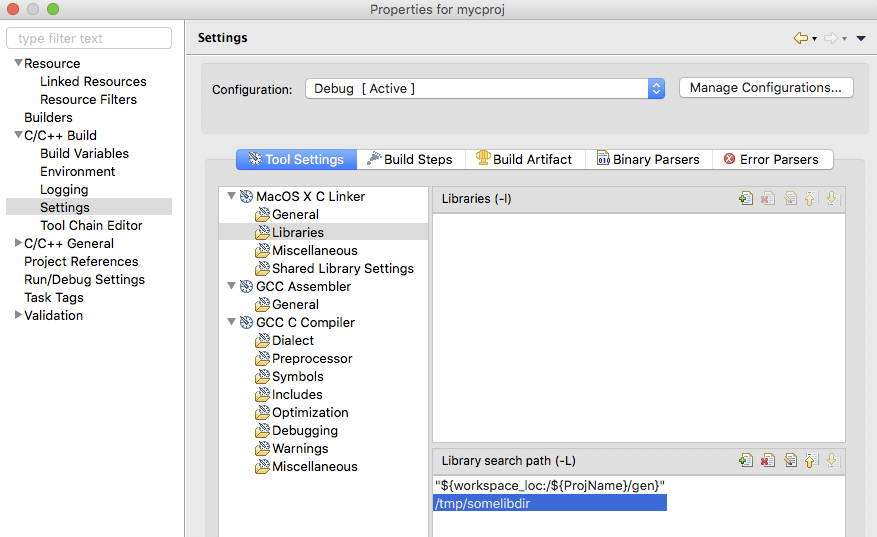
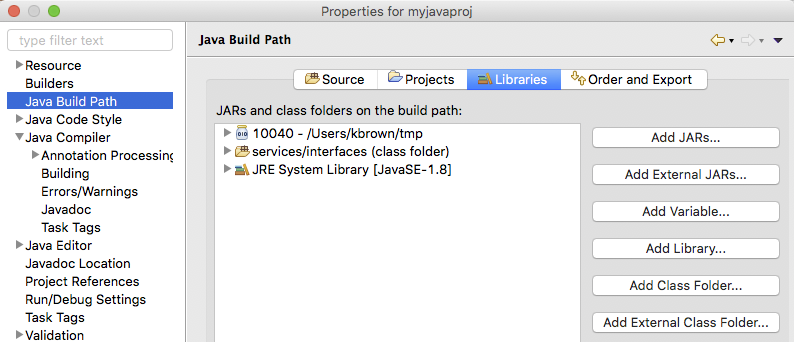

---

This work is licensed under the Creative Commons CC0 License

---

# Improve mechanism for inter-domain references - Ensure .int (interface) files are provided to MASL editor 
### xtUML Project Design Note


### 1. Abstract

This note describes the design for an improvement to the way inter-domain
dependencies are managed inside BridgePoint.  

### 2. Document References

<a id="2.1"></a>2.1 [BridgePoint DEI #9021](https://support.onefact.net/issues/9021) Headline DEI    
<a id="2.2"></a>2.2 [BridgePoint DEI #9679](https://support.onefact.net/issues/9679) Headline SR    
<a id="2.3"></a>2.3 [Prototype implementation for automatic generation of INT files](https://github.com/xtuml/mc/pull/289)   
<a id="2.4"></a>2.4 [Project Rapping SRS - One Fact Internal](https://docs.google.com/document/d/1Drp57-DkoHEkMmCsTmUrp5TLZvSgdv5cLRSNEmhnbPU/edit)   

### 3. Background

3.1  Cross references  
MASL models may refer to public model elements from other domains.  Domains
publish their publicly-accessible elements in files named `<domain>.int`.  The
depending Domain's MASL then refers to these elements using the form 
`<domain>::<element>`.  BridgePoint currently requires these `.int` files to be 
copied by the user into the `models/` folder of the project that wants to use 
the elements inside the `.int`. In addition to declared Domains, MASL provides
a number of "service domains" (e.g. Logging and Filesystem).  These service 
domains are not modeled in the user interface.  The `.int` file for the service 
domain is provided to the MASL Domain or MASL Project being modeled to give 
access to the public elements. Copying these files around is a pain for the user.

There are only two styles of element that can be referred to across domains: types 
and services. 

3.2  Types  
Types can be referred to in two ways:  
* Declared as a transient variable in an action body.  
* A structural type reference type, encoded with a special name of the type itself (e.g. `MyDom::MyType`). 

Note that the idiom that BridgePoint currently enforces requires that the modeler 
create a local xtUML type that mirrors the type found in the other domain. This 
is to allow the MASL export to produce properly constructed MASL in the face of 
BridgePoint not having type references as first class model elements. 

3.3  Services  
Services can be referred to in only one way: invoked in an action body.   

Inside a MASL Domain modeled in xtUML, a terminator is implemented as a port and 
terminator services are operations in a required interface.  These are invoked from
within the MASL Domain with the form `<port>~><operation>()`.  Within the MASL
Domain, utility services are invoked with `<service domain>::<service>()`.   

Inside a MASL Project the service domain access follows the `<domain>::<service>()` 
form.  The MASL Project uses the `.int` files under the project's `models/` folder 
to validate the calls. The MASL inside the Project may also refer to public domain 
services in wired domains that are in the same workspace using the same 
`<domain>::service()` form.  Note that validation is performed against the 
`<domain>.int` and not the project's ports and messages.  

3.4  Terminology clarification  
The word "project" is overloaded in MASL-xtUML modeling.  Throughout this document
references to "project", "eclipse project", or "xtUML project" all refer to a directory
on disk that contains a `.project` XML file that allows for the display and management
of the project inside the BridgePoint/eclipse framework.  

A "MASL Project" is a special model that contains components and component references
wired together to from a cohesive system in the MASL sense of interconnected domains.
Hence, in the MASL idiom inside BridgePoint, a project may contain a MASL Project or 
a MASL Domain.  But more generally, a project may also contain an xtUML model, a C
or Java application, or just a set of files.   

### 4. Requirements
The requirements in this section stem from the high-level requirement in the SRS[2.3]:
```
9679-1: Inter-domain references shall be managed without manual intervention from the user.   
```  

4.1  The user shall be able to specify a list of resources that may contain
  interface files to use when validating the MASL model inside the current project.  
4.1.1  The list shall be configurable for each project.  
4.1.2  The list shall be persisted in a file under the project.  
4.1.3  User shall be able to specify an absolute path for a dependent resource  
4.1.4  User shall be able to specify a workspace-relative path for a dependent resource   
4.1.5  User shall be able to specify a filesystem-relative path for a dependent resource
4.1.6  The depended-upon resource may be either a file or a directory   

4.2  When the current model is being validated, it shall assure that validation 
  is performed against up-to-date dependencies.    

4.3  The contents of the dependend-upon resources shall not be persisted as part of the
  configuration management of the depending project.  
  
4.4  The contents of the dependend-upon resource shall not be exported to the depending
  project's `masl/` folder as part of "Export MASL [Domain|Project]".  

### 5. Analysis

5.1 Original BridgePoint MASL Parser Implementation  
5.1.1  In the original (current) implementation, the xText tooling is restricted
  to only look for MASL to parse and validate under the `models/` folder of the
  project.   
5.1.2  This restriction in the MASL parser is implemented in commits 
  [34197ec](https://github.com/xtuml/bridgepoint/commit/34187ec2b37800b3ba35988c44535933a25b1a0f) 
  and [fbc9e5d](https://github.com/xtuml/bridgepoint/commit/fbc9e5dae5a04b6bfc26433a8e2dcf4b63ad5cc0).   
5.1.2.1  Of specific interest is the file `org.xtuml.bp.xtext.masl/src/org/xtuml/bp/xtext/masl/lib/MASLDelegatingAllContainerState.xtend` 
  and the function `getVisibleContainerHandles()` and the setup of `newVisibleHandles`.  

5.2  Comparable Implementations  
5.2.1  Eclipse CDT and the specification of linker arguments (-L and -l)  
5.2.1.1  Linker arguments are accessed via the project properties (Figure 1)   
5.2.1.2  The linker dependencies are not shown in the UI tree view of the project  
5.2.1.3  The user may specify a file system or workspace-based variable path
  
__Figure 1__  

5.2.1.4  The values set by the user are stored in the `<project>/.cproject` XML file under 
  the project in the linker section, like this:
 ```xml
 <tool id="cdt.managedbuild.tool.macosx.cpp.linker.macosx.exe.debug.472415824" name="MacOS X C++ Linker" superClass="cdt.managedbuild.tool.macosx.cpp.linker.macosx.exe.debug">
     <option id="macosx.cpp.link.option.paths.871898357" superClass="macosx.cpp.link.option.paths" valueType="libPaths">
         <listOptionValue builtIn="false" value="/Users/kbrown/tmp"/>
         <listOptionValue builtIn="false" value="&quot;${workspace_loc:/${ProjName}/gen}&quot;"/>
     </option>
``` 

5.2.2  Eclipse JDT and configuring the classpath   
5.2.2.1  Java project class path is also edited via the project properties (Figure 2)  
  
__Figure 2__  

5.2.2.2  The Package Explorer view shows the user-configured "Referenced Libraries" in
  a special way in the project tree (Figure 3).   
5.2.2.3  The user-configured values are persisted in `<project>/.classpath` file  
  
__Figure 3__  

5.3  Options  
5.3.1  Automatic dependency creation  
5.3.1.1  An exploratory modification [2.3] was made to MASL export that created 
`.int` files based on the MASL inside the model.  Based on feedback from users, it
was decided this solution was not flexible enough, so it was never promoted.  

5.3.2  Provide the depended-upon paths to BridgePoint from a persisted source.   
5.3.2.1  This could be done via a new file under the project or leveraging a 
different mechanism such as the marking editor (persisting the data into 
`application.mark`).   
5.3.2.2  In any such form, BridgePoint would need to read this file and pass the 
data to the xText Parser so it could "see" these library folders (see 5.1).  

5.3.3  Leverage existing eclipse infrastructure for linked resources.  
5.3.3.1  Eclipse provides the ability to create linked resources that are basically
the equivalent of a Unix filesystem symbolic link.  
5.3.3.2  By placing these links under the current project's `models/` folder there
is not change to the xText MASL Parser needed, it sees the contents of the linked
resource automatically. 
 
5.4  The chosen option to use is 5.3.3.   

### 6. Design

6.1  Persisting linked resources  
6.1.1  Eclipse persists the links in the XML inside the `<project>/.project` file
as shown in Figure 1.  
6.1.2  This file may be edited by hand.  
6.1.3  The linked resources may point to either a folder or a file.  It is important
to note that if a folder is linked, the xText MASL parser will read and parse 
__all__ the MASL files inside that folder.  Users should be careful to create direct
file dependencies in situations where the folder behavior is not desireable.  

6.2  Linked resources fulfill all the requirements of absolute as well as 
relative path support.  
6.2.1  Eclipse provides the variable `WORKSPACE_LOC` that resolves to the root
directory of the workspace on the file system.  
6.2.2  Eclipse provides the variable `PROJECT_LOC` that resolves to the root 
directory of the project on the file system.  
6.2.3  It should be noted that relative paths are not persisted inside this XML.  If
a relative path is needed the number of `../` entries in the path are substituted 
with a matching number (see line 63 in Figure 1).  This line corresponds to 
the actual path `PARENT_LOC/../../servicedom3`.   
6.2.4  In the XML, linked files have type value 1 and folders have type value 2.  

```xml
 49     <linkedResources>
 50         <link>
 51             <name>models/servicedom</name>
 52             <type>2</type>
 53             <locationURI>WORKSPACE_LOC/services/interfaces</locationURI>
 54         </link>
 55         <link>
 56             <name>models/servicedom2</name>
 57             <type>2</type>
 58             <location>/Users/kbrown/tmp/servicedom2/ints</location>
 59         </link>
 60         <link>
 61             <name>models/servicedominvalid</name>
 62             <type>2</type>
 63             <location>PARENT-2-PROJECT_LOC/servicedom3</location>
 64         </link>
 65         <link>
 66             <name>models/sac.int</name>
 67             <type>1</type>
 68             <locationURI>WORKSPACE_LOC/calc/masl/calc.int</locationURI>
 69         </link>
 70     </linkedResources>
```
__Figure 1: Links in a .project file__

6.3  User interface  
6.3.1  Linked resources can be created in the current version of BridgePoint 
with `New > Folder > Advanced` or `New > File > Advanced` and selecting the 
"Link to alternate location" radio button.  
6.3.2  Since the `New > ...` approach is not particularly user friendly, we shall
implement a new page on the Project Preferences dialog named "Project Dependencies" 
that supports the specification of files or folders to depend upon.  
6.3.3  When the user enters a new value on this page, the link shall be created 
under the `models/` folder.  
6.3.4  The page will support removing an existing dependency.  
6.3.5  The page shall not allow duplicate entries.  
6.3.6  The page shall show existing links when the project properties dialog is
opened.  
6.3.7  The page shall show the current value of `WORKSPACE_LOC` and `PROJECT_LOC`.  
 
6.4 Operation   
6.4.1  The xText parser needs to use the most up-to-date information when it validates
MASL. Therefore, it may need to run a project refresh to pick up any dependency 
changes as it begins validation.  


### 7. Design Comments

None.  

### 8. User Documentation

8.1  BridgePoint does not currently have a help doc on project preferences so one
shall be created or added to the existing xtUML system preferences document.   
8.2  Update the MASL modeling guide with a pointer to the project preferences help
for dependencies.  

### 9. Unit Test

9.1  Test valid links using   
9.1.1  Absolute paths  
9.1.2  Variable WORKSPACE_LOC in a path  
9.1.3  Variable PROJECT_LOC in a path  

9.2  Test invalid links or a linked resource has no data    

9.3  Test that updates in the linked resources are used during parse.  That is, 
the latest data is used for validation and not outdated, cached information.  

9.4  Test the User Interface  
9.4.1  Dependency page is populated on popup with current linked resources  
9.4.2  User may add new links  
9.4.3  User may remove existing links  
9.4.4  Changes are persisted properly  


9.5  Verify that the contents of the dependend-upon resources are not persisted 
as part of the configuration management of the depending project.  
  
9.6  Verify the contents of the dependend-upon resource are not exported to the 
depending project's `masl/` folder as part of "Export MASL [Domain|Project]".   

### End
