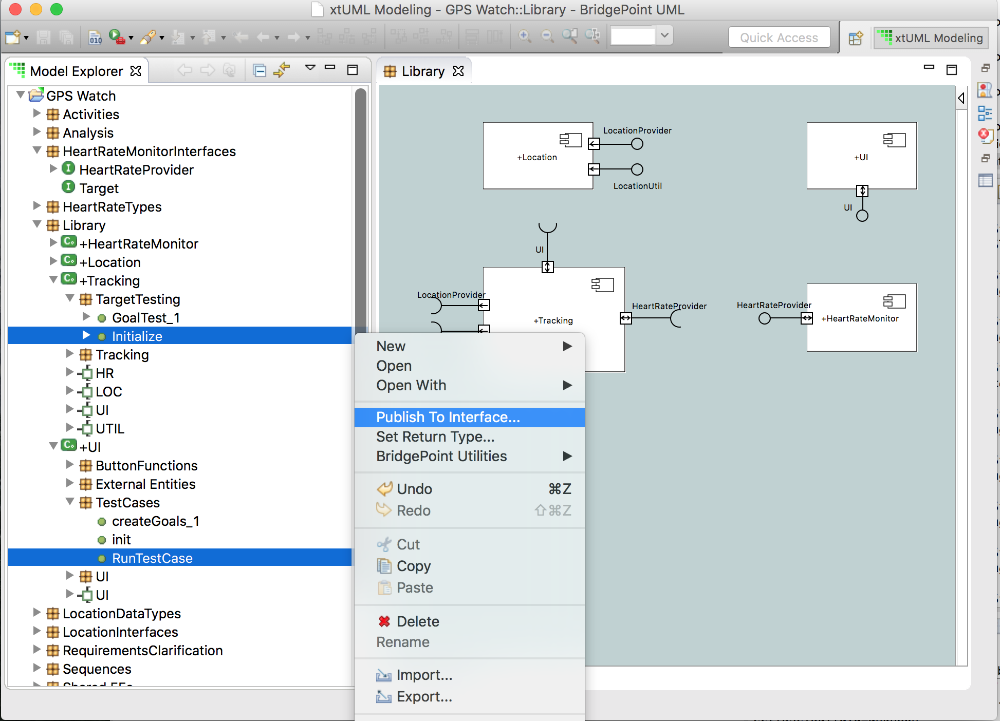
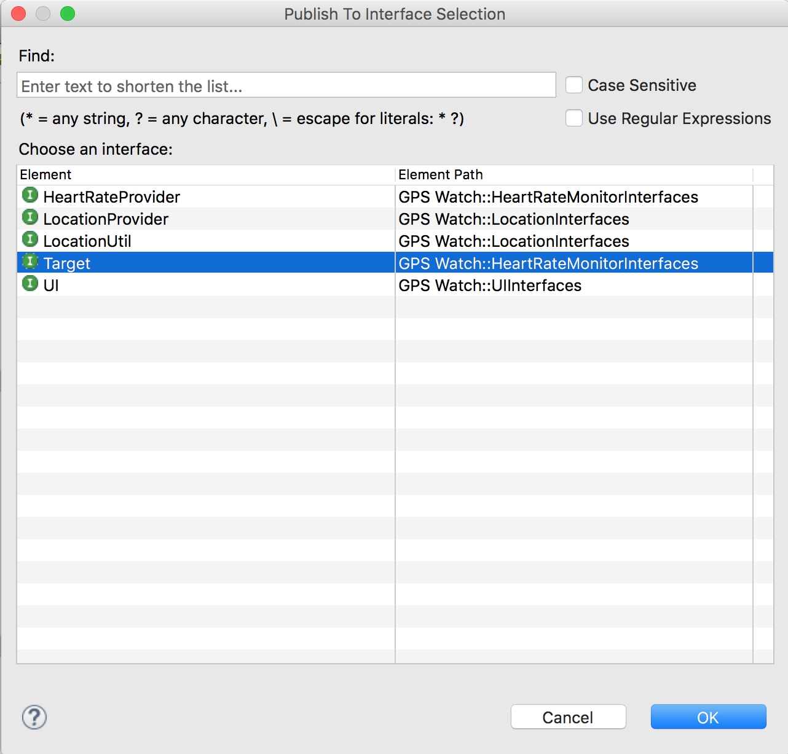

---

This work is licensed under the Creative Commons CC0 License

---

# Simplify interface creation for MASL domains
### xtUML Project Implementation Note

### 1. Abstract

Introduce a mechanism that simplifies Interface creation for users that follow a xtUML "domain-first" design approach.  

### 2. Document References

<a id="2.1"></a>2.1 [BridgePoint DEI #9958](https://support.onefact.net/issues/9958)  
<a id="2.2"></a>2.2 [BridgePoint DEI #9995](https://support.onefact.net/issues/9995) Manual test for Publish to interface...  

### 3. Background

Creating interfaces that match domain functions in the domain-first design idiom of xtUML 
modeling is manual and time-consuming when there are lots of domain functions with lots of 
parameters.  

This issue is raised to introduce a mechanism that simplifies Interface creation in this situation.  

### 4. Requirements

4.1 Given a user-selected group of domain functions, automatically create interface operation(s) with 
the same signature.  
4.2 If there are no duplicate names present, but a single matching name exists in the source and target, the 
target shall be updated with the source.  
4.2.1 An update in this situation means parameters, description, and return value from the source is replaced in the target.  
4.3 If duplicate names are present, warn the user and provide a unique name in the target for the operation.  
4.3.1 A duplicate is defined when:  
4.3.1.1 More than 1 function with the same name exists in the user's source selection.  
4.3.1.2 More than 1 operation exists in the selected target Interface with the same name as one of the source functions.  
4.3.2 When a duplicate is identified the unique target operation name shall be of the form: <base name>-X, where 
<base name> is the name of the duplicate and "-X" provides an incrementing count to assure a unique name.  

### 5. Work Required

5.1 Update the pre-existing instance (PEI) data associated with the bp.core/CME model to add a new CME for 
this functionality. This change shall be made in bp.core/sql/context_menu.pei.sql.    
5.1.1 The new CME shall be named: "Publish to interface..."  
5.1.2 The new CME shall be added in model elements of type S_SYNC  
5.1.3 The new CME shall allow multi-select  
5.1.4 Selection shall be allowed across functions (S_SYNC) in any/all packages under a model.  

5.2 Introduce a new CME Function to process the new CME action defined by the updated PEI data. This is 
added to the ooaofooa model in Functions/Context Menu Entry Functions  
5.2.1 Following the required format for the CME actions archetype, this function is named: S_SYNC_PublishToInterface. Additionally, an operation was introduced, ooaofooa::Interface::publishOperationFromFunction(syncID:Sync_ID), to perfom the task of creating an interface operation based on a given function (S_SYNC) id.  
5.2.2 The OAL in this function shall present the user with a dialog that allows the user to select an 
existing Interface to "publish" the selected function(s) to.  
5.2.3 After selection of the target Interface, the user selects the "OK" button to proceed.  
5.2.3.1 If there are no duplicates [4.3.1], the operation is completed, and all selected functions will have been 
published to the target Interface.  
5.2.3.2 It there were duplicates, the user will be informed of the source function and target operation name for each duplicate encountered.  

### 6. Implementation Comments

6.1 A helper function, integer numFunctionsSelected(string:functionName), was added to  
ooaofooa::External Entities::Selection to faciliate the work required to check for duplicates in the source selection. 
This was needed because the CME infrastructure processes a multi-select one element at a time. To be able to 
inform the user of the source function and target operation name of such a source function duplicate, a mechanism was needed to check the entire source selection for duplicate names.  

6.2 While reviewing documentation it was noted that "Sync references" and "Sync with library" have descriptions backwards, I fixed this.  

6.3 Example CME and dialog  
*Publish To Interface CME*



*Publish To Interface Dialog*



### 7. Unit Test

7.1 Following are the degrees of freedom used for testing this issue. Issue [2.2] is a manual test 
used for testing of this issue.   
```
DOF For "Publish to Interface"
Source Element Type
1. Function

Source selection multiplicity
1. Single
2. Mulitiple

Source select name multiplicity
1. No duplicate names in selection
2. Duplicate names in selection  

Target name conflict multiplicity
1. No Conflict
2. One Element in target with same name
3. Multiple Elements in target with same name

Target Updates
1. Return Type
2. Return Dimensions
3. Parameter Changed
4. Description Changed
```

### 8. User Documentation

8.1 bridgepoint/src/org.xtuml.bp.doc/Reference/UserInterface/BridgePointContextMenuTools   

### 9. Code Changes

Fork/Repository: rmulvey/bridgepoint  
Branch: 9958_publish_interface  

<pre>

org.xtuml.bp.core/models/org.xtuml.bp.core/ooaofooa/Component/Interface/
    Interface.xtuml
org.xtuml.bp.core/models/org.xtuml.bp.core/ooaofooa/External Entities/
    External Entities.xtuml
org.xtuml.bp.core/models/org.xtuml.bp.core/ooaofooa/Functions/
    Context Menu Entry Functions/Context Menu Entry Functions.xtuml
org.xtuml.bp.core/sql/context_menu.pei.sql
org.xtuml.bp.core/src/org/xtuml/bp/core/ui/actions/.gitignore
org.xtuml.bp.core/generate.xml


</pre>

### End

