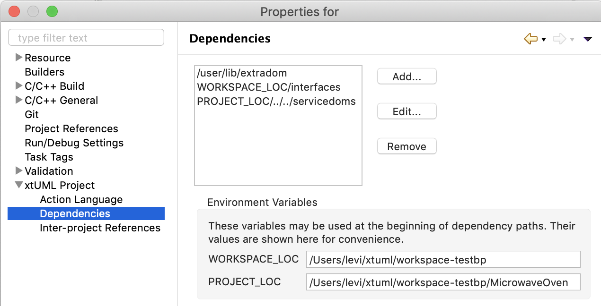

What's New in BridgePoint 6.12.0
========================

Release Highlights
-------
* New MASL Features
* MASL Bug Fixes 
* MASL Example Models
* Set Operations
* Documentation Updates

-------------------------------------------------------------------------------

New MASL Features
------
#### Dependency Manager
BridgePoint now supports configuring project dependencies via the Project Preferences.  

  

The dependencies are stored under the project in a file named `.dependencies`. Additional 
help information is available inside the tool at `Help > BridgePoint UML Suite Help > Reference > User Interface > xtUML Modeling Perspective > Preferences > Project Preferences > Project Dependencies`.  
 
BridgePoint uses the configured dependencies to locate `*.int` files that provide additional 
MASL data to validate MASL action bodies.  

#### Coverage Tool

This work begins to measure how much of the MASL language is being used by an input set of 
models. Coverage is based upon the degree to which meta-model elements are populated. Namely, 
after an application model has been loaded into the model of MASL structure (meta-model), the 
classes and associations are queried and tallied. A ratio of model elements employed over the 
total number of possible elements provides a repeatable measurement by which to evaluate coverage.   

The coverage report is written during the MASL export process to `<project>/gen/code_generation/masl_output.txt`  
 
  

The report shows what classes and relationships are used (indicated by `*`) or not (indicated by space). The 
name of the meta-model element or relationship is shown in the column underneath the indicator.  

MASL Bug Fixes
------
Numerous bug fixes are included in this release.  The complete list is available in the [Release Notes](../ReleaseNotes/ReleaseNotes.html).  

Highlights include:   
* [10120](https://support.onefact.net/issues/10120): Valid syntax causes problems with parser and export (MASL)
* [10044](https://support.onefact.net/issues/10044): Polymorphic creation events cause round trip to crash
* [10132](https://support.onefact.net/issues/10132): Malformed for loop causes tool hang
* [10139](https://support.onefact.net/issues/10139): Published interface operations have wrong dialect in MASL mode
* [10156](https://support.onefact.net/issues/10156): Support export of public EDTs for MASL

MASL Example Models
------
Two new MASL example models are now available.  The models are published in the public BridgePoint 
models repository on github.   

The [PEI model](https://github.com/xtuml/models/tree/pei_masl/VandMC_testing/mctest/pei) exercises classes, associations, and MASL action language constructs.   

The [calculator model](https://github.com/xtuml/models/tree/master/masl/calculator) demonstrates MASL domain and MASL project modeling following the recommended 
idiom.  It is translatable and compilable with the MASL model compiler.  

Set Operations
------
BridgePoint OAL now supports operations on instance sets.   

| Operator(s) | Description              |
|-------------|--------------------------|
| &#124; , +  | set union                |
| &           | set intersection         |
| -           | set difference           |
| ^           | set symmetric difference |

Instance set expressions are used for set arithmetic. Instance reference and instance reference 
set types are valid operands for instance set expressions.  During evaluation, an operand of 
instance reference type is considered to be an instance set containing exactly one instance.

Additional help documentation is available inside the tool via `Help > BridgePoint UML Suite Help > Reference > OAL Reference > Expressions`.  

Documentation Updates
------
The MASL Modeling and Conversion Guide is updated to reflect new functionality and for overall 
cleanup and improvement.   
 
The entire help documentation for BridgePoint preferences is rewritten to bring it up to date
for available workspace and project preferences.   
